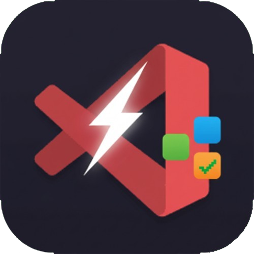
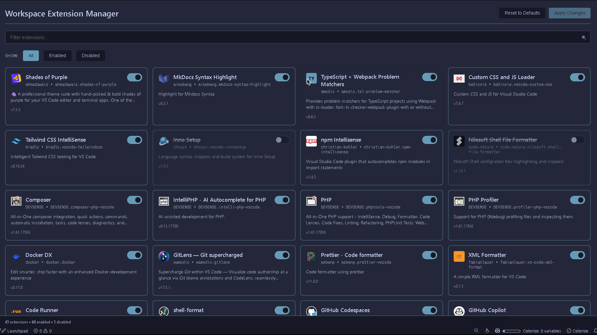
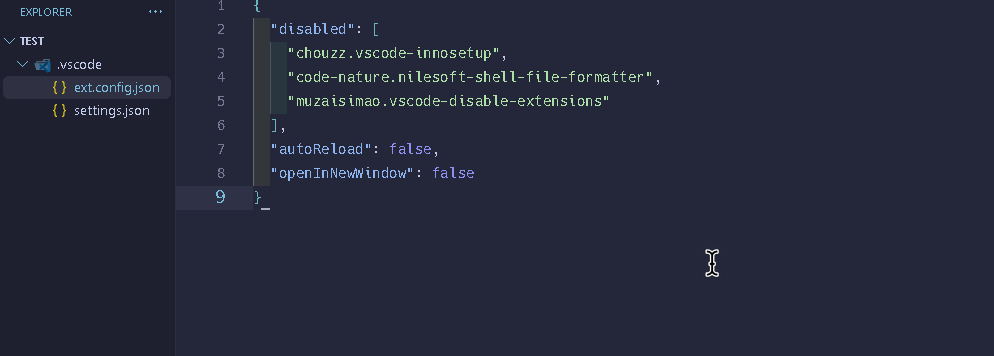

# Quick Extension Manager

<p align="center">
  
</p>

<p align="center">
  <strong>Efficiently manage VS Code extensions per workspace for optimal performance and focus</strong>
</p>

<p align="center">
  <a href="https://marketplace.visualstudio.com/items?itemName=ToolsHive.vscode-quick-extension-manager">
    
  </a>
  <a href="https://marketplace.visualstudio.com/items?itemName=ToolsHive.vscode-quick-extension-manager">
    
  </a>
  <a href="https://marketplace.visualstudio.com/items?itemName=ToolsHive.vscode-quick-extension-manager">
    
  </a>
  <a href="https://github.com/ToolsHive/Quick-Extension-Manager/blob/main/LICENSE.txt">
    
  </a>
</p>

Quick Extension Manager provides a modern webview interface for managing workspace-specific extension profiles in Visual Studio Code. Enable or disable extensions per workspace to improve performance, reduce resource usage, and maintain focus on project-relevant tools.

## Features

### Modern Webview Interface
- **Professional card-based UI** with real extension icons, names, and descriptions
- **Real-time search** to filter extensions by name, ID, or description
- **Smart filtering** options to show All, Enabled, or Disabled extensions
- **Interactive toggle switches** for intuitive enable/disable controls
- **Live status tracking** with extension counts and pending changes indicator
- **Responsive design** that adapts to VS Code themes



### Workspace Management
- **Per-workspace configuration** allowing different extension sets for each project
- **Team collaboration** through shareable `.vscode/ext.config.json` files
- **Performance optimization** by reducing VS Code startup time and memory usage
- **Automatic activation** when workspace contains configuration files
- **Cross-platform support** for Windows, macOS, and Linux

### Full Command Suite
- **Interactive extension management** through modern webview interface
- **Direct enable/disable** functionality for immediate control
- **Marketplace integration** with links for extension updates
- **Quick access shortcuts** to GitHub repository, settings, and issue reporting
- **Comprehensive CLI integration** using VS Code's official command-line interface

## Quick Start

1. **Install the extension** from the [VS Code Marketplace](https://marketplace.visualstudio.com/items?itemName=ToolsHive.vscode-quick-extension-manager)
2. **Open Command Palette** with `Ctrl+Shift+P` (Windows/Linux) or `Cmd+Shift+P` (macOS)
3. **Execute** `Quick Extension Manager: Manage Extensions`
4. **Use the webview interface** to search, filter, and toggle extensions
5. **Apply changes** to save configuration and restart VS Code with new settings

## Available Commands

Access all functionality through the Command Palette (`Ctrl+Shift+P` / `Cmd+Shift+P`):

| Command | Description |
|---------|-------------|
| **Quick Extension Manager: Manage Extensions** | Opens the modern webview interface for extension management |
| **Quick Extension Manager: Enable Extension Manager** | Activates the extension functionality |
| **Quick Extension Manager: Disable Extension Manager** | Temporarily disables the extension |
| **Quick Extension Manager: Update Extension** | Opens marketplace page to check for updates |
| **Quick Extension Manager: Open GitHub Repository** | View source code and contribute to the project |
| **Quick Extension Manager: Open Settings** | Access extension configuration options |
| **Quick Extension Manager: Report Issue** | Submit bug reports or feature requests |

### Primary Feature: Extension Management Interface

The **"Workspace Extension Manager"** opens in a dedicated webview panel with the following capabilities:

**Visual Interface:**


**Key Capabilities:**
- **Authentic extension icons** displaying actual logos from each extension
- **Interactive toggle switches** for immediate enable/disable functionality
- **Real-time pending changes** indicator before applying modifications
- **Smart filtering** that excludes built-in VS Code extensions from the list
- **Team-friendly configuration** saved to workspace folder for version control

## Configuration

The extension automatically creates and manages a `.vscode/ext.config.json` file in your workspace root:

```json
{
  "disabled": [
    "ms-python.python",
    "esbenp.prettier-vscode",
    "bradlc.vscode-tailwindcss"
  ],
  "autoReload": true,
  "openInNewWindow": true
}
```



### Configuration Properties

| Property | Type | Default | Description |
|----------|------|---------|-------------|
| `disabled` | `string[]` | `[]` | Array of extension IDs to disable for this workspace |
| `autoReload` | `boolean` | `true` | Automatically restart VS Code when applying changes |
| `openInNewWindow` | `boolean` | `true` | Open workspace in new window instead of reusing current window |

**Tip:** Right-click on any extension in the Extensions view and select "Copy Extension ID" to get the exact identifier.

## Usage Examples

### Team Development Scenarios
1. **Create project-specific configuration** using the extension management interface
2. **Commit `.vscode/ext.config.json`** to your version control repository
3. **Team members automatically inherit** consistent extension setup
4. **Maintain different profiles** for different project types and requirements

### Project-Specific Optimization
- **Frontend Projects** - Disable backend-focused extensions (Python, Java, C++)
- **Backend Projects** - Disable frontend tooling (React, Vue, Angular extensions)
- **Documentation Projects** - Keep only writing and markdown extensions active
- **Mobile Development** - Focus on platform-specific tooling only

### Performance Benefits
- **Large Codebases** - Reduce extension overhead for faster workspace loading
- **Remote Development** - Minimize network traffic and latency issues
- **Resource-Constrained Environments** - Optimize memory and CPU usage
- **Focused Development** - Eliminate distractions from irrelevant extensions

## Technical Implementation

This extension leverages VS Code's official [Command Line Interface (CLI)](https://code.visualstudio.com/docs/editor/command-line) for reliable extension management:

1. **Configuration Detection** - Automatically detects `.vscode/ext.config.json` in workspace
2. **Command Construction** - Builds CLI commands with `--disable-extension` flags
3. **Process Execution** - Launches new VS Code instance with modified extension state
4. **Workspace Preservation** - Maintains current workspace and window configuration

### Architecture Overview

The extension follows a modular service-based architecture:

- **ExtensionManagerWebviewService** - Handles the modern UI interface
- **ConfigurationService** - Manages loading and validation of workspace settings
- **WorkspaceService** - Provides workspace path operations and validation
- **CommandBuilderService** - Constructs VS Code CLI commands with proper arguments
- **ExecutionService** - Handles command execution and VS Code process management
- **UserInteractionService** - Manages all user dialogs and notifications

## Requirements

- **VS Code Version**: 1.58.0 or higher
- **VS Code CLI Access**: Command-line interface must be available in system PATH
- **Workspace Context**: Extension activates when workspace contains `.vscode/ext.config.json`
- **Platform Support**: Windows, macOS, and Linux

## Installation

### From VS Code Marketplace
1. Open VS Code
2. Navigate to Extensions view (`Ctrl+Shift+X`)
3. Search for "Quick Extension Manager"
4. Click **Install**

### From Command Line
```bash
code --install-extension ToolsHive.vscode-quick-extension-manager
```

### Manual Installation
1. Download the `.vsix` file from [GitHub Releases](https://github.com/ToolsHive/Quick-Extension-Manager/releases)
2. Run `code --install-extension path/to/extension.vsix`

## Development and Contributing

### Project Structure
```
src/
├── constants.ts              # Extension constants and configuration
├── types.ts                  # TypeScript interfaces and type definitions
├── extension.ts              # Main extension entry point
├── managers/
│   └── extensionManager.ts   # High-level extension orchestration
└── services/
    ├── configurationService.ts    # Configuration management
    ├── workspaceService.ts        # Workspace operations
    ├── commandBuilderService.ts   # CLI command construction
    ├── userInteractionService.ts  # User interaction handling
    ├── executionService.ts        # Command execution
    └── extensionManagerWebviewService.ts # Webview interface
```

### Building from Source
```bash
# Clone the repository
git clone https://github.com/ToolsHive/Quick-Extension-Manager.git

# Install dependencies
npm install

# Build the extension
npm run build

# Package for distribution
npm run pkg:build
```

### Contributing Guidelines
1. Fork the repository on GitHub
2. Create a feature branch from `main`
3. Make your changes with appropriate tests
4. Ensure all existing tests pass
5. Submit a pull request with detailed description

## Troubleshooting

### Common Issues

**Extension not activating**
- Ensure `.vscode/ext.config.json` exists in workspace root
- Check that VS Code version meets minimum requirements (1.58.0+)

**CLI command not found**
- Verify VS Code CLI is installed and available in system PATH
- Follow the [official setup guide](https://code.visualstudio.com/docs/editor/command-line#_common-questions)

**Configuration not saving**
- Check workspace folder write permissions
- Ensure `.vscode` directory exists and is writable

**Extensions not disabling properly**
- Verify extension IDs are correct (right-click extension → "Copy Extension ID")
- Check that VS Code restarted completely after applying changes

## Links and Resources

- **GitHub Repository**: [ToolsHive/Quick-Extension-Manager](https://github.com/ToolsHive/Quick-Extension-Manager)
- **VS Code Marketplace**: [Quick Extension Manager](https://marketplace.visualstudio.com/items?itemName=ToolsHive.vscode-quick-extension-manager)
- **Issue Tracker**: [Report Issues](https://github.com/ToolsHive/Quick-Extension-Manager/issues)
- **Feature Requests**: [Submit Ideas](https://github.com/ToolsHive/Quick-Extension-Manager/issues/new)
- **VS Code CLI Documentation**: [Command Line Interface](https://code.visualstudio.com/docs/editor/command-line)

## Changelog

See [CHANGELOG.md](./CHANGELOG.md) for detailed release notes and version history.

## License

This project is licensed under the [MIT License](./LICENSE).

Copyright (c) 2025 ToolsHive. All rights reserved.

